# Vyapar: Agentic Commerce on Razorpay (Track 1)


Whole ideation behing the product 0->1: [Read Here!](https://medium.com/@dhruvmali999/building-vyapar-a-week-inside-the-agentic-commerce-rabbit-hole-471f87c0c855) <br>
Demo Video Link: [Video!](https://drive.google.com/file/d/1k1tIk4KdWIrE2-o91w27hEBLiKEC2f9X/view?usp=sharing)<br>
Live website: [Click Here!](https://vyaparxrazorpay.vercel.app)
 
---

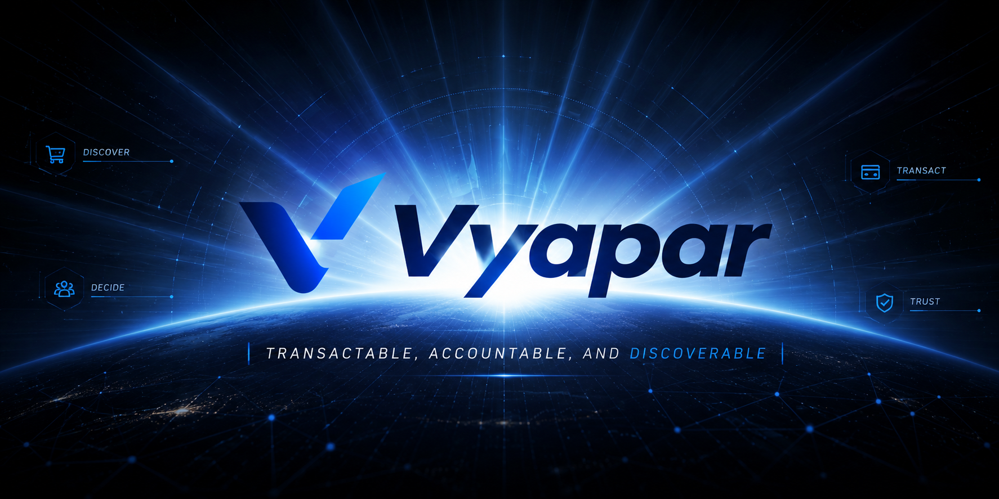

---
## Table of Contents
 
1. [What Vyapar Is](#1-what-vyapar-is)
2. [Design Philosophy](#2-design-philosophy)
3. [The Policy Gateway: Every Money Action Is Bounded and Gated](#3-the-policy-gateway--every-money-action-is-bounded-and-gated)
4. [The Mandate System: Human-Issued, Scoped, Revocable Authority](#4-the-mandate-system--human-issued-scoped-revocable-authority)
5. [The Audit Ledger and Merchant-Owned Orders](#5-the-audit-ledger-and-merchant-owned-orders)
6. [Making the Merchant Discoverable and Transactable](#6-making-the-merchant-discoverable-and-transactable)
7. [The Growth Agent and the Buyer Agent](#7-the-growth-agent-and-the-buyer-agent)
8. [Growing Revenue: Measured Upsell, Not Just a Claim](#8-growing-revenue-measured-upsell-not-just-a-claim)
9. [Proving Agent-to-Agent Commerce](#9-proving-agent-to-agent-commerce)
10. [A Real Pilot: Live Shopify Catalog, Honest Payment Boundary](#10-a-real-pilot-live-shopify-catalog-honest-payment-boundary)
11. [In-App Checkout via Claude Desktop](#11-in-app-checkout-via-claude-desktop)
12. [Catalog Legibility: Does an Agent Actually See the Whole Catalog?](#12-catalog-legibility-does-an-agent-actually-see-the-whole-catalog)
13. [Graceful Failure: Demonstrated, Not Just Claimed](#13-graceful-failure--demonstrated-not-just-claimed)
14. [The Dashboard](#14-the-dashboard)
15. [Real-World Evidence and Rollout Path](#15-real-world-evidence-and-rollout-path)
16. [Multi-Merchant Discovery and Distribution](#16-multi-merchant-discovery-and-distribution)
17. [WhatsApp Merchant Control Channel](#17-whatsapp-merchant-control-channel)
18. [Tech Stack](#18-tech-stack)
19. [Quick Setup](#19-quick-setup)

## 1. What Vyapar Is (GoKwik Insipred, )

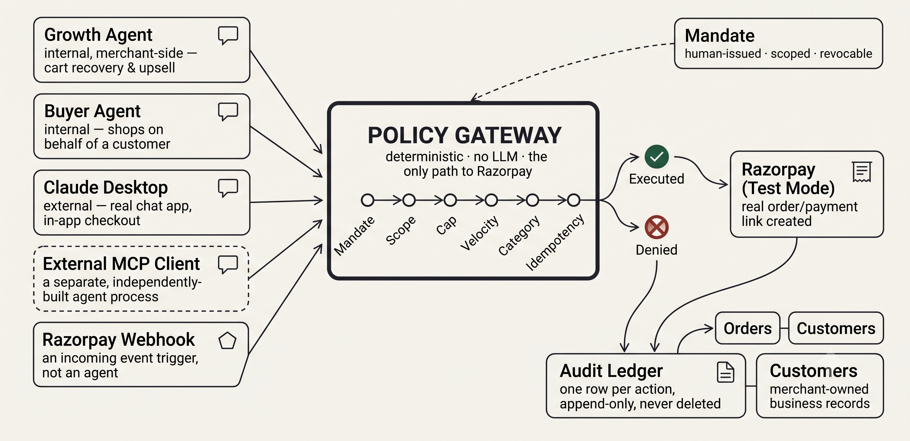
<p align="center">
  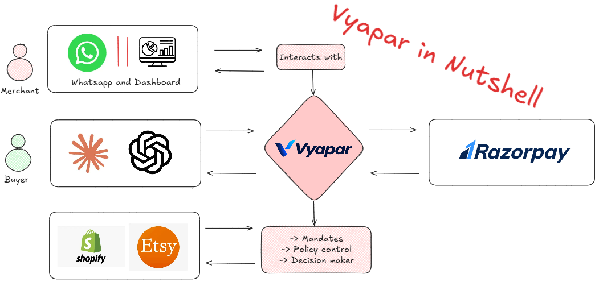
</p>
 
Vyapar answers both halves of the problem statement's title, not just one.
 
It is an **agentic commerce layer** that makes a merchant transactable end-to-end by any
AI buyer  not just an agent Vyapar itself built, but a genuinely independent one,
discovering the merchant only through a published protocol surface. And it is a
**revenue-growth system**  a live, measured cross-sell mechanism that increases order
value during checkout, with the uplift shown as a real number, not narrated.
 
Both halves sit on top of the same architectural spine: a deterministic **Policy
Gateway** that is the only thing in the system capable of moving money, gated by
**mandates**  scoped, human-issued, revocable spending authorizations  with every
action, approved or denied, written to an **append-only audit ledger**.
 
---
 
## 2. Design Philosophy
 
Two decisions shape everything else in this project, made early and never revisited:
 
**LLMs decide *what* to attempt. They never decide *whether money moves*.** Every agent
in this system  internal or external  can only ever construct a `Proposal`: an item,
an amount, a category, a stated reason. That proposal is handed to a single,
LLM-free function that runs a fixed sequence of deterministic checks against it. The
agent has no code path to Razorpay that bypasses this function. This is true for the
internal Growth Agent, the internal Buyer Agent, every external MCP client, and every
webhook-triggered action  there is exactly one door into money movement, and an LLM
never stands behind it.
 
**Every claim in this project is stated at the confidence level it actually earned.**
Simulated scenarios are labeled `SIMULATED`. A manifest that follows a discovery
convention but isn't certified against a formal spec says so. A statistical finding run
at N=10 per goal is presented as a directional signal with raw counts shown, never
dressed up with a confidence interval the sample size doesn't support. A pilot catalog
connection that's real is shown next to a checkout that's explicitly test-mode, with the
boundary stated on-screen, not buried. This discipline shows up everywhere below, and
it's deliberate: overclaiming what's real is a worse failure mode for a project like
this than a smaller, honestly-scoped one.
 
---
 
## 3. The Policy Gateway  Every Money Action Is Bounded and Gated
 
Every proposal, regardless of where it came from, passes through the same sequence of
checks, in order, fail-fast:
 
1. **Mandate validity**  does a non-expired, non-revoked mandate exist for this agent?
2. **Mandate scope**  does the proposed amount and category fit within *this specific
   mandate's* granted scope (not just the global policy)?
3. **Per-transaction cap**  does the amount exceed the merchant's configured ceiling?
4. **Daily velocity cap**  has this agent's cumulative spend today already hit its
   limit?
5. **Category allowlist**  is this category one the merchant has opted to allow agents
   to purchase in at all?
6. **Discount ceiling**  if a discount is proposed, does it exceed the merchant's
   configured maximum?
7. **Idempotency**  has this exact proposal already been processed (guarding against a
   retried or duplicated agent call double-charging)?
A proposal that clears every check reaches Razorpay's test-mode API and a real order or
payment link is created. A proposal that fails any check is denied with a specific,
named reason  `MANDATE_EXPIRED`, `MANDATE_SCOPE_EXCEEDED`, `CAP_EXCEEDED`,
`VELOCITY_EXCEEDED`, `CATEGORY_NOT_ALLOWED`, `DISCOUNT_TOO_HIGH`, `DUPLICATE_PROPOSAL`
 never a generic failure. Every one of these reasons is translated into a plain-English
sentence a non-technical merchant can read directly, and that sentence is what surfaces
in the ledger and, later, inside an agent's own conversational response.

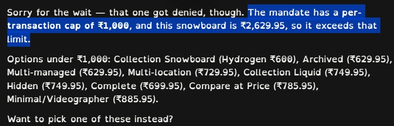
 
This gateway has not changed in shape since it was first built. Everything added in
later phases  the MCP server, the webhook receiver, the external buyer process, the
Shopify-sourced catalog, the upsell flow, the Claude Desktop integration  is a new
*caller* of this same function, never a new path around it.
 
---
 
## 4. The Mandate System  Human-Issued, Scoped, Revocable Authority
 
A mandate is not an API key. It is the specific thing this project claims most directly
maps to the emerging shape of agent-authorized payments across the industry  AP2's
delegated-payment mandates, and NPCI's proposed Unified Agent Protocol, which is itself
built on UPI Circle's existing pattern of a primary user delegating a capped, revocable
spending authority to a secondary party. Vyapar's mandate is structurally the same
shape, built before the underlying rail (UPI Circle/UAP-native delegation) existed to
carry it  which is stated plainly rather than implied to be more than it is.
 
Concretely, a mandate is issued by an explicit human action  a dashboard "Issue
Mandate" flow, not an automatic refresh  and carries:
 
- A **maximum amount** the agent may spend under this authorization.
- A **category scope**  which kinds of purchases this authorization covers, not just
  the merchant's global allowlist.
- An **expiry**, after which the mandate stops working without any further action.
- A **consent method**, honestly labeled (`dashboard_click`  not a cryptographic
  signature; a production system following AP2's actual proof-of-authorization model
  would need one, and this project says so rather than implying otherwise).
A mandate can be **revoked** at any moment from the dashboard, and the very next
proposal attempted under it fails immediately and correctly  this revocability was
demonstrated live, not just implemented. An agent can *discover* its own currently
active mandate and scope via a read-only tool (`get_active_mandate`), but it can never
create, extend, or grant itself one  that authority stays exclusively with a human,
on purpose, since letting an agent self-authorize its own spending would defeat the
entire point of the model.
 
---
 
## 5. The Audit Ledger and Merchant-Owned Orders

<p align="center">
  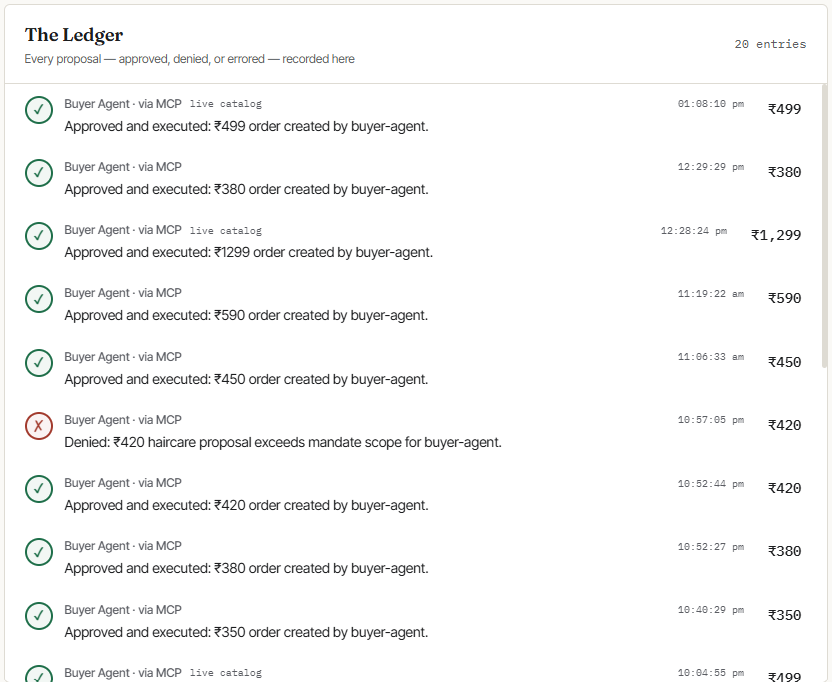
  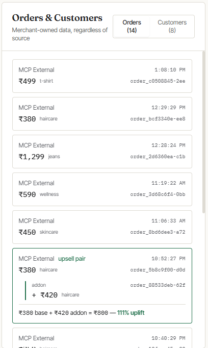 
</p>

Every proposal  approved or denied, from any source  writes exactly one row to an
append-only ledger, with three possible terminal states: `executed`, `denied`, `error`.
Nothing is ever overwritten or deleted. This ledger is the audit trail the problem
statement's bar explicitly asks for, and it's genuinely queryable and drillable, not a
log file.
 
Separately, and only for successfully `executed` outcomes, the system writes to real
`orders` and `customers` tables  first-class business records, distinct from the audit
ledger, each order traceable back to the exact ledger row that authorized it. This
distinction matters: the ledger is a record of *decisions*, the orders table is a record
of *outcomes*, and a merchant using this system would own both, in their own database,
regardless of which agent, protocol, or entry point produced the sale. Every order is
tagged with its `source`  internal Growth Agent, internal Buyer Agent, external MCP
client, or webhook  so a merchant (or a judge) can see, at a glance, that a sale
originating from a completely independent external agent lands in exactly the same
business record as one from the merchant's own tooling.
 
---
 
## 6. Making the Merchant Discoverable and Transactable

<p align="center">
  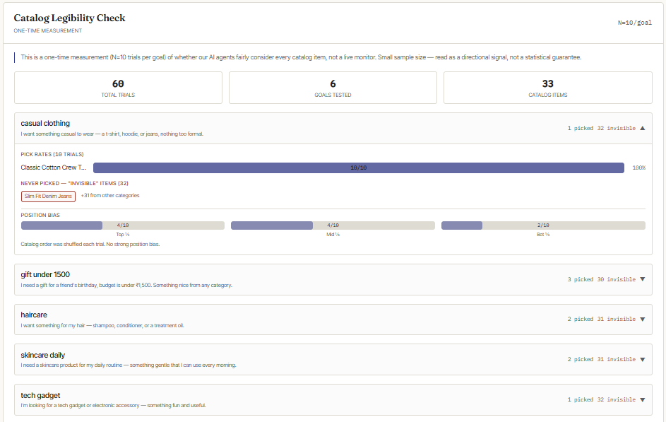
</p>

 
A merchant with a database of products is not automatically visible or usable to an AI
agent. Vyapar closes that gap on two fronts, deliberately modeled on the discovery
conventions emerging across ACP, UCP, and MCP rather than inventing a bespoke one:
 
**Vyapar exposes itself as an MCP server**, not just an MCP client. Any MCP-capable
agent  Claude Desktop, Claude Code, a completely separate process built by someone
else  can connect and call `browse_catalog`, `get_product`, `get_active_mandate`,
`submit_purchase_proposal`, `submit_addon_proposal`, and `check_proposal_status`
directly, with no custom integration code on their end. Every one of these tools that
can move money routes through the exact same Policy Gateway described in Section 3 
there is no separate, less-guarded path for external callers.
 
**Vyapar publishes a `.well-known/agent-commerce.json` discovery manifest**, in the
spirit of the discovery conventions UCP and similar protocols are converging on
(explicitly labeled as not a certified implementation of any one spec, since no such
certification exists yet to claim). It states the merchant's identity, mode (test), the
MCP endpoint, the catalog feed, and a public, non-sensitive summary of the current
policy limits  so an external agent can check "would this even be allowed" before
attempting a proposal, the same way capability negotiation is meant to work across this
emerging protocol landscape.
 
Together, these mean the "agent-readable catalog" and "transactable end to end"
requirements aren't just true of Vyapar's own internal agents  they're true of any
agent that speaks MCP, reachable through a standard, published surface.
 
---
 
## 7. The Growth Agent and the Buyer Agent
 
Two internal agents exercise this system from opposite directions, and both are
strictly proposal-only  neither has any code path to Razorpay except through the
gateway.
 
**The Growth Agent** acts on the merchant's behalf: recovering an abandoned cart, or
suggesting a cross-sell/upsell after a completed order, using the catalog's
`pairs_with_ids` relationships to ground its suggestions in real product pairings
rather than an LLM inventing a plausible-sounding bundle.

**The Buyer Agent** acts on a customer's behalf: given a natural-language shopping goal,
it browses the real catalog, reasons over real prices and categories, and constructs a
proposal  this is the internal proof that an AI shopper, not just a merchant-side
agent, can transact safely within the same gated system.
 
---
 
## 8. Growing Revenue: Measured Upsell, Not Just a Claim

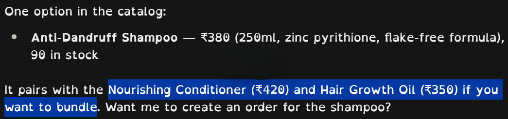
 
The problem statement's title has two halves  grow revenue, *or* make the merchant
transactable  and for most of this project's life, only the second half had a real,
measured demonstration behind it. This gap was closed directly.
 
During a live checkout  including inside the Claude Desktop flow described in Section
11  a successful purchase can surface one paired add-on item, looked up deterministically
from the catalog's real `pairs_with_ids` relationships (never an LLM's improvised
suggestion of what "might pair well"). If the agent conversationally offers it and it's
accepted, that becomes a second, independent proposal  evaluated fresh, against the
same mandate's *remaining* scope, through the identical six-plus-one checks. Accepting a
base purchase does not pre-authorize its addon; an addon can be denied on its own merits
even immediately after a successful purchase, which is itself a legitimate second
graceful-failure demonstration, not a contrived one.
 
When an addon is accepted, the resulting order is linked back to its base order in the
`orders` table, and the dashboard shows the combined result as a real, computed number 
base value, addon value, combined total, and the resulting percentage uplift  visible
on screen, not just described out loud during a demo. This is the concrete, literal
answer to "grow the merchant's revenue": a real transaction's value, measurably higher
because of a gated, catalog-grounded suggestion.
 
---
 
## 9. Proving Agent-to-Agent Commerce
 
The problem statement's "why now" names agent-to-agent commerce specifically as the open
problem the global protocol race is racing to solve. Proving Vyapar's own agents can
transact with Vyapar's own gateway doesn't answer that  it only proves the gateway is
safe when called by code the project itself wrote.
 
The real test built for this: a **second, fully independent process**, sharing zero
code with the merchant backend. It does not import Vyapar's internal types, does not
hardcode any catalog item IDs, and runs its own separate LLM call, entirely disconnected
from the merchant's own codebase. It discovers Vyapar purely by fetching the published
`.well-known` manifest and connecting to the MCP server described in Section 6  the
same surface any unrelated third party's agent would use. Given a natural-language
goal, it independently browses the real catalog, reasons about what to buy, retrieves
its own mandate's scope, and submits a proposal  landing in the exact same ledger,
passing through the exact same checks, as every other transaction in the system.
 
Run alongside the Claude Desktop flow in Section 11, this produces the closing proof:
two agents, built independently, that have never seen each other's code, both
transacting with the same merchant, both fully audited, both bounded by the same gate.
 
---
 
## 10. A Real Pilot: Live Shopify Catalog, Honest Payment Boundary
 
To move past "we built infrastructure that could theoretically support a real
merchant" toward an actual, verifiable pilot, Vyapar connects to a real Shopify store's
real product catalog via the Shopify Admin API.
 
A merchant (or, for testing, a Shopify development store) grants a **read-only**
`read_products` access token through Shopify's own two-minute custom-app flow  no code
written on their side, no OAuth review process, no waiting. Real products  titles,
live prices, live stock  flow into Vyapar's catalog automatically, correctly converted
and mapped, alongside (not replacing) the original demo catalog. A manual refresh (and
optional scheduled sync) keeps this from becoming a stale, one-time snapshot: changing a
price or stock level in the real Shopify store and clicking "Refresh catalog" reflects
the change without a server restart.
 
**The payment side of this pilot is deliberately, explicitly kept on Razorpay test
mode**, using Vyapar's own test account  not the pilot merchant's real money. This is
not a shortcut taken to save time; it's a considered boundary. Actually settling real
funds into a real third-party merchant's real bank account requires Razorpay
Partner/Route onboarding: a formal Partner relationship with Razorpay, a Linked Account
for the merchant backed by real KYC documentation, and real compliance obligations
around refunds and chargebacks  a business and compliance process, not something a
weekend of coding can or should route around. Every place this pilot connection is
shown  the catalog UI, the discovery manifest, purchase confirmations  carries a
paired disclosure: **"Live from Shopify" always shown next to "Checkout: Razorpay Test
Mode,"** so the real/test boundary is never ambiguous to anyone looking at it, merchant
or judge.
 
---
 
## 11. In-App Checkout via Claude Desktop


<p align="center">
  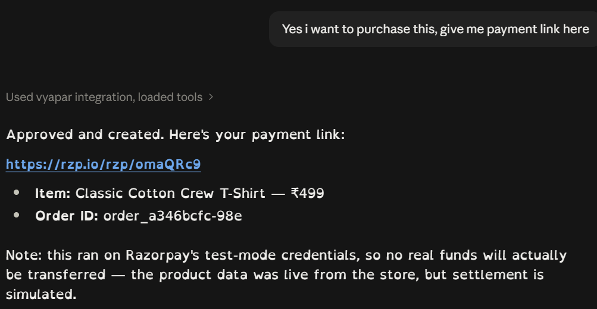
  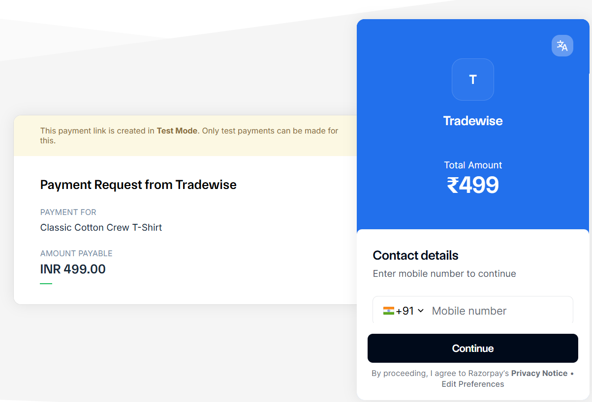 
</p>

Everything above converges into a single, live demonstration: Vyapar's MCP server,
already built for any external agent, wired directly into the actual Claude Desktop
application  an app this project didn't build  via a local connection, no hosting or
public URL required.
 
From inside a normal Claude Desktop conversation: a natural-language shopping request
triggers `browse_catalog`, returning real Shopify-sourced product data reasoned over
conversationally, not from a hardcoded list. Claude retrieves its own active mandate's
scope via `get_active_mandate`, and submits a purchase proposal through the same gated
pipeline as everything else in this document. If it clears every check, a real
test-mode Razorpay order is created, and the purchase  along with any offered upsell
from Section 8  is confirmed back to the user without ever leaving the chat interface.
Switching to the dashboard immediately afterward shows the exact same transaction as a
new ledger row and a new order, attributed to the correct source, with no manual entry
required to make it appear there.
 
The single most important property of this flow: when a proposal is denied  a cap
lowered live, a mandate scope exceeded  the specific reason is explained back to the
user **inside the chat itself**, in plain language, not just recorded silently in a
dashboard the user isn't looking at. This is what makes "explainable" a property of the
actual checkout experience, not only of an audit log a merchant might check later.
 
---
 
## 12. Catalog Legibility: Does an Agent Actually See the Whole Catalog?
 
Everything built so far assumes that if a product exists in the catalog and the
checkout mechanism works, an agent will fairly consider it. That assumption was tested,
not left unchecked.
 
A small, honestly-scoped measurement runs a fixed set of natural-language shopping
goals against the real current catalog, repeated across a modest number of trials per
goal, recording exactly which item an LLM picked each time  including recording a
failed or invalid pick as a real result, not discarding it. From this: a plain pick-rate
per item per goal (shown as raw counts, e.g. `3/10`, never dressed up as a percentage
alone), a list of items that were shown to the agent but never once chosen across all
trials for a goal, and an informally-stated observation about whether earlier-listed
items were picked disproportionately often.
 
This is deliberately not presented with statistical machinery the sample size can't
support  no confidence intervals, no significance testing. It's stated as a directional
signal, at exactly the confidence level a run of this size earns, with the sample size
shown next to every number on the dashboard rather than hidden behind a polished-looking
statistic. The panel presenting this is visually and structurally separated from the
rest of the dashboard, labeled plainly as a one-time measurement, not a live monitor.
 
---
 
## 13. Graceful Failure  Demonstrated, Not Just Claimed
 
The problem statement asks for one failure handled gracefully. Vyapar has several,
demonstrated live, each producing a distinct, correctly-explained ledger entry rather
than a generic error:
 
- **Per-transaction cap exceeded**  lower the merchant's cap below a product's price,
  attempt the purchase, watch it denied with the specific amount and limit stated.
- **Mandate scope exceeded**  a mandate authorized for one category or amount is used
  to attempt a purchase outside that scope, denied with `MANDATE_SCOPE_EXCEEDED`,
  distinct from a simple expiry.
- **Mandate expired or revoked**  revoke an active mandate from the dashboard, and the
  very next attempt under it fails immediately, distinctly labeled from a scope
  failure.
- **Upsell addon exceeding remaining mandate scope**  a successful base purchase
  followed by an addon offer that would push total spend past what the mandate still
  permits, denied on its own merits even though the base purchase just succeeded.
- **Merchant not opted in**  with AI agent transactability toggled off from the
  dashboard, any external proposal is denied immediately, before even reaching the
  six-check gateway, with a clear, distinct reason.
Every one of these has been triggered on demand, and every one surfaces its specific
reason both in the dashboard's audit ledger and, where relevant, conversationally inside
the actual agent interface being used (Claude Desktop)  not only in a log a merchant
would need to go looking for separately.
 
---
 
## 14. The Dashboard
 
The dashboard's role changed over the course of this project: it began as a debugging
console for the builder, and was deliberately redesigned once the underlying system was
complete, into something a merchant or a judge could read at a glance without narration.
 
Structurally, it presents as a set of distinct registers rather than an undifferentiated
grid: the audit ledger itself, styled as ruled rows with a stamp-style mark
distinguishing approved from denied decisions rather than a scattering of colored status
badges; merchant controls for policy limits, catalog connection, and mandate
issuance/revocation; a merchant-owned orders and customers view, with linked upsell
pairs shown as a connected result rather than two unrelated rows; and a protocol-surface
panel exposing the MCP endpoint, discovery manifest, webhook receiver, and the catalog
legibility findings.
 
A consistent typographic rule runs through all of it: genuine system data  amounts,
order and mandate IDs, timestamps, endpoint URLs, batch identifiers  is visually
distinguished from narrative and explanatory text, so a real audit reference reads as
exactly that, not as debug output that leaked into the interface. Every control and
action that existed in the dashboard's earlier, denser form remains fully reachable;
nothing was cut in the course of making it presentable.
 
---
 
## 15. 💀💀💀Real-World Evidence and Rollout Path (Small Thesis Behind the Product)
 
This project's central claim  that a merchant becoming AI-transactable is mostly an
onboarding and trust problem, not a technical one  isn't speculative; it's grounded in
what's actually happened in the market this year.
 
OpenAI's first attempt at exactly this category of product, Instant Checkout (launched
with Shopify and Etsy in September 2025), reached fewer than 15 live merchants out of
over a million eligible ones within six months, and was shelved before a relaunch in
February 2026 as "Buy it in ChatGPT." The bottleneck wasn't protocol capability  the
checkout mechanism worked  it was that almost no merchant actually integrated it.
 
Separately, GoKwik and PayU launched a live, named, multi-brand D2C agentic-checkout
experience inside ChatGPT in India in July 2026, and their own repeated framing across
every announcement is close to a checklist of the exact frictions that sank Instant
Checkout's first attempt: merchants join with no engineering work, no new integration,
and no separate listing fee, and keep full ownership of their catalogue, customer, and
conversion data. That last guarantee  data and customer-relationship ownership  is
precisely what Section 5's merchant-owned orders and customers tables are a direct,
working answer to, not just a description of.
 
The realistic deployment shape this project follows: **NPCI defines agent-native
delegation primitives at the UPI rail level (UPI Circle, UPI Reserve  both still
"upcoming" even in GoKwik's own live announcements) → a platform layer (Razorpay, or a
GoKwik-style enabler built on top of a PSP) implements the policy gateway, mandate
system, and merchant onboarding once, as a product → individual merchants opt in
through a settings toggle, connecting an already-existing catalog, writing zero code.**
Vyapar is a working prototype of that middle layer, built ahead of the bottom layer
being finalized  which is stated here as exactly what it is, not oversold as more.
 
---
 
## 16. Multi-Merchant Discovery and Distribution

Everything described in Sections 1–15 operated within a single merchant's scope. This
section addresses two questions that arise the moment a platform claims to support more
than one: how does an AI buyer discover and choose between merchants, and how does the
platform avoid introducing hidden bias into that choice?

### How MCP tool discovery actually works today

A common misconception  and one this project does not pretend otherwise about  is that
an AI agent can spontaneously discover and invoke an MCP server it has never been
connected to, the way a human might stumble onto a website through a search engine.
**That is not how MCP works today.** Connection is a one-time, explicit user action:
either a local stdio config entry (the Claude Desktop setup from Section 11), or a
connector added through Anthropic's Connectors Directory at `claude.ai/settings/connectors`,
which currently lists 400+ third-party and first-party integrations.

Once connected  and only once connected  Claude automatically *invokes* the right
tool on future relevant prompts, based on how well the tool's description matches the
user's intent, without the user needing to name it explicitly. The quality of those
descriptions (rewritten in this build to be trigger conditions, not just functional
summaries  "use this whenever the user expresses intent to buy" rather than "browse
the catalog") directly affects how reliably this automatic selection fires.

Anthropic's Connectors Directory is the real, production distribution path for MCP
servers that want to be discoverable by Claude users. It involves a formal submission
and review process with its own requirements and timeline, separate from building the
server itself.

### What was built vs. what a real directory listing still requires

**Built:** A working remote MCP server at a public HTTPS URL
(`https://vyapar-server1.onrender.com/mcp`), speaking Streamable HTTP, serving the
exact same tool implementations as the local stdio connection  `browse_catalog`,
`get_product`, `submit_purchase_proposal`, `submit_addon_proposal`,
`get_active_mandate`, `check_proposal_status`  with no forked or divergent logic
between the two paths. A static bearer token protects the endpoint (documented honestly
as demo-grade).

The remote server proves the underlying mechanism is real and correct. Submission itself
is future work, stated as such.

### Multi-merchant ranking: transparent, not opaque

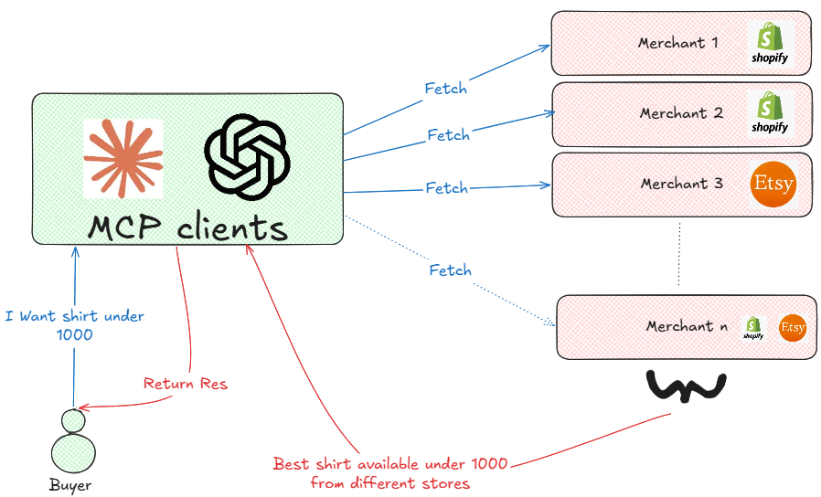

When `browse_catalog` is called without a specific `merchant_id`, it returns products
from **every merchant that has opted in** (the AI Agent Transactability toggle from
Section 13), not just the first one seeded. Each item in the response carries its
`merchant_id` and `merchant_name`  visible to the calling agent and, through it, to the
user  so the attribution is never flattened away.

The sort rule applied to these cross-merchant results is:
**price ascending within category**  stated in a `sort` metadata field on every
response, alongside a `sort_note` confirming no hidden merchant weighting. Every
opted-in merchant's items are ranked by the same visible rule, full stop.

### End-to-end proof

With two merchants seeded (Vyapar Wellness  skincare, wellness, accessories; UrbanGear
Co.  apparel, electronics), each with independent policy caps, independent mandates,
and independent catalog items, a programmatic end-to-end test confirmed:

- Cross-merchant `browse_catalog` returns items from **both** merchants, correctly
  labeled, sorted by the stated rule.
- A purchase proposal against UrbanGear Co. clears all six policy checks using
  UrbanGear's own policy config, creates a Razorpay test-mode order, and writes a
  ledger row and order row both correctly attributed to `merchant_2`.
- A mandate issued for Vyapar Wellness **cannot** authorize a purchase against
  UrbanGear Co.'s catalog  the proposal is denied with `MANDATE_SCOPE_EXCEEDED`,
  proving merchant-scoped mandate isolation.
- Each merchant's ledger view contains only its own entries  no cross-contamination.

---

## 17. WhatsApp Merchant Control Channel (Meet customer where they are)

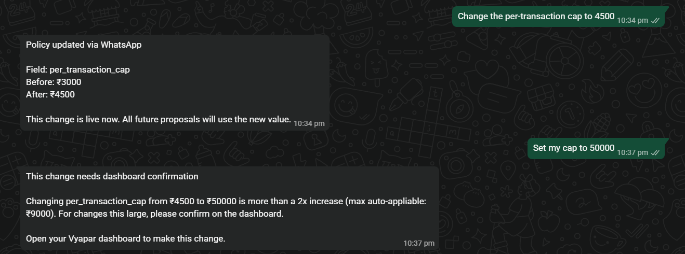

Everything described in Sections 3–5 governs what happens when an AI agent proposes
spending money. This section describes a parallel channel  WhatsApp, via Twilio  that
lets the merchant govern the *policy itself* from their phone, subject to the exact same
architectural discipline: an LLM may parse, but only deterministic, inspectable code
decides whether a change is applied.

### The flow

1. The merchant sends a free-text WhatsApp message to the Twilio sandbox number  e.g.
   *"change the per-transaction cap to 4500"* or *"approve prop_abc123."*
2. **Twilio signature validation** confirms the webhook genuinely came from Twilio, and a
   **hardcoded merchant-number check** confirms the sender is the registered merchant 
   both checks run before any message reaches the LLM.
3. An LLM parses the free text into a structured, typed object 
   `{ type: "policy_field_change", field: "per_transaction_cap", to: 4500 }` or
   `{ type: "single_use_override", proposal_id: "prop_abc123", action: "approve" }`. The
   LLM's system prompt explicitly states it never decides whether a change should be
   applied  it only extracts what was requested.
4. That structured object is handed to `evaluatePolicyChangeRequest()`  a **pure,
   deterministic, unit-tested function** with no I/O and no LLM call inside it  which
   decides, based on a fixed rule set, whether this specific change is small enough to
   auto-apply or must be deferred to the dashboard.
5. If auto-appliable: the change is written to `policy_config`, and WhatsApp replies with
   the exact field, before value, and after value  never a generic "done."
6. If deferred: WhatsApp replies telling the merchant to confirm on the dashboard, stating
   *why* in plain language (e.g. "that's more than 2x your current cap").
7. If the message couldn't be parsed: a help-text reply with example commands.

**Every outcome  applied, deferred, parse-failed, or sender-rejected  writes exactly
one row to `whatsapp_audit_log`**, visible in the dashboard's "WhatsApp Logs" tab,
following the same append-only, one-row-per-action discipline as the purchase ledger.

### The field whitelist and why it's small

Only three policy fields are editable via WhatsApp: `per_transaction_cap`,
`daily_velocity_cap`, and `discount_ceiling`. Category allowlists, mandate parameters,
and everything else require the dashboard. This is deliberate  a small, named,
hardcoded whitelist is the safety property this channel relies on. Expanding it is future
work that belongs behind real merchant authentication, not a casual addition.

### The bounds-check rules

For each whitelisted field, a fixed multiplier determines the auto-apply boundary:

- **Increases**: up to 2x the current value auto-applies; beyond that, deferred.
- **Decreases**: up to 50% reduction auto-applies; beyond that, deferred.
- **Discount ceiling** specifically: changes above 50% absolute are always deferred.

These constants are named (`MAX_AUTO_CAP_MULTIPLIER`, `MAX_AUTO_DECREASE_FACTOR`,
`MAX_AUTO_DISCOUNT_CEILING_PCT`) and live in a single file
(`policy-change-evaluator.ts`), not scattered across the codebase.

### Single-use override: rescuing one denied sale

When the Policy Gateway denies a purchase that exceeds the cap by a notable margin
(amount > 2x the current cap), an **outbound** WhatsApp message is sent to the merchant
automatically: *"A ₹4,500 order was just denied  your cap is ₹1,000. Reply 'approve
prop_abc123' to let this one order through."*

If the merchant replies with that approval:

- The original denied proposal is **re-run through `processProposal()`** with a
  single-use exception flag scoped to that exact `proposal_id` only.
- The cap in `policy_config` is **completely unchanged**  only this one specific,
  already-denied proposal gets a second chance.
- The override is recorded in a `single_use_overrides` table and cannot be used twice.
- The resulting order (if created) is tagged with source `whatsapp_merchant_override` in
  both the ledger and orders view.

This is not a temporary cap raise  it's a scoped, auditable, non-reusable exception
that leaves global policy untouched for every other proposal.

---

## 18. Tech Stack
 
| Category | Technologies Used |
| :--- | :--- |
| **Mastermind** | Claude code (Powered by me ) |
| **Backend & API** | Node.js, Express, TypeScript, Zod |
| **Database** | SQLite (`better-sqlite3`) |
| **Payments** | Razorpay Node.js SDK |
| **AI / LLM** | AWS Bedrock SDK, Model Context Protocol (MCP) |
| **Frontend Dashboard** | React, Vite, TailwindCSS, Framer Motion |
| **WhatsApp Channel** | Twilio SDK (WhatsApp Sandbox) |
| **Tooling** | esbuild, Vite, tsc, concurrently |
| **Pilot** | Shopify |


---

## 19. Quick Setup

**Prerequisites:** Node.js v18+ and npm.

```bash
git clone https://github.com/P47Parzival/Vyapar.git
cd Vyapar
npm start
```
Wait for the build to complete and open http://localhost:5173/


```bash
cp .env.example .env
```

| Variable | Required For | Where to Get |
| :--- | :--- | :--- |
| `RAZORPAY_KEY_ID` | Payments (test mode) | [Razorpay Dashboard](https://dashboard.razorpay.com) → Settings → API Keys |
| `RAZORPAY_KEY_SECRET` | Payments (test mode) | Same as above |
| `BEDROCK_API_KEY` | AI agents (Growth, Buyer) | AWS Bedrock console |
| `AWS_REGION` | AI agents | Default: `ap-south-1` |
| `TWILIO_ACCOUNT_SID` | WhatsApp channel | [Twilio Console](https://console.twilio.com) |
| `TWILIO_AUTH_TOKEN` | WhatsApp channel | Same as above |
| `TWILIO_WHATSAPP_FROM` | WhatsApp channel | Twilio Sandbox number (e.g. `whatsapp:+14155238886`) |
| `MERCHANT_WHATSAPP_NUMBER` | WhatsApp channel | Your personal number (e.g. `whatsapp:+91XXXXXXXXXX`) |

> The dashboard UI works fully without these  you can explore the interface, view the ledger, manage policies and mandates. AI agent triggers and payment features require valid credentials.

### Claude Desktop MCP Setup (Optional)

To use Vyapar as an MCP server inside Claude Desktop (for in-app checkout):

1. Open Claude Desktop → Settings → Developer → Edit Config
2. Add to `mcpServers`:

```json
{
  "mcpServers": {
    "vyapar": {
      "command": "npx",
      "args": ["tsx", "packages/server/src/mcp-server/mcp-stdio.ts"],
      "cwd": "/path/to/Vyapar"
    }
  }
}
```

3. Restart Claude Desktop. Vyapar tools (`browse_catalog`, `submit_purchase_proposal`, etc.) will appear automatically.

Alternatively, on **Windows** run `setup.bat` or on **Mac/Linux** run `bash setup.sh`  these scripts handle install, environment setup, and print MCP config instructions.


## Made by Dhruv Mali, 5x National level hackathon winner🏆🏆, 2L+ in prizes, 2x startup founder and failure, 2.5L+ in funding, Nasa space apps global 🌍 nominee, National finalist in Google hackathon'26.